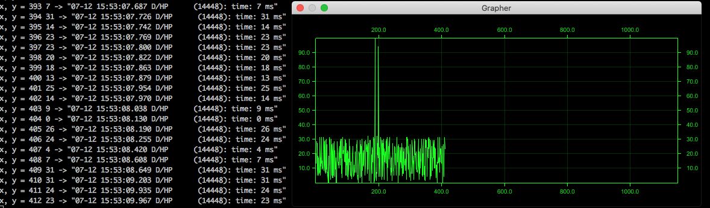

# grapher
Utility that renders a graph using the lines from a file or log. It reads input from stdin.

This is an example how to pipe logcat output (logging utility for android phones) into the program. Should work in other contexts too.

```
    adb logcat -v time | cargo run --release -- --x_max "1150" -r "time: (\d+)"
```



```
➜  grapher git:(master) ✗ cargo run -- --help
    Finished dev [unoptimized + debuginfo] target(s) in 0.09s
     Running `target/debug/grapher --help`
grapher 0.1.0

USAGE:
    grapher [OPTIONS] --regex <regex>

FLAGS:
    -h, --help       Prints help information
    -V, --version    Prints version information

OPTIONS:
    -c, --capture <capture_method>     How the numbers will be captured from the regex groups. "1" to capture the first
                                       group as y and use the number lines that matched as x "-1" to capture the first
                                       group as y and use the number lines that matched as y "12" to capture two groups
                                       and use the first group as x and the second group as y "21" to capture two groups
                                       and use the first group as y and the second group as z
    -r, --regex <regex>                This regex should have 1 or two groups that contain a number. This will be
                                       rendered into the graph
        --reset_regex <reset_regex>    When a line matches this regex the current graph will be cleared
    -t, --title <window_title>         Title of the window
        --x_min <x_min>                Minimum x coordinate for the graph
        --x_max <xmax>                 Maximum x coordinate for the graph
        --y_max <ymax>                 Maximum y coordinate for the graph
        --y_min <ymin>                 Minimum y coordinate for the graph
```
